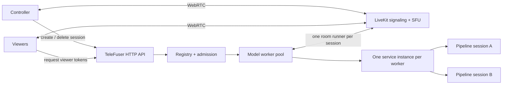
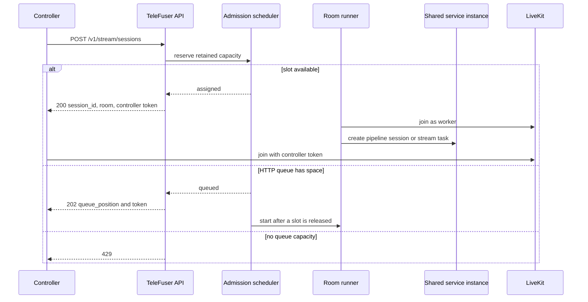
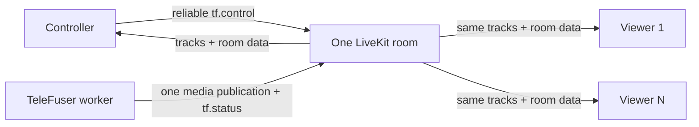
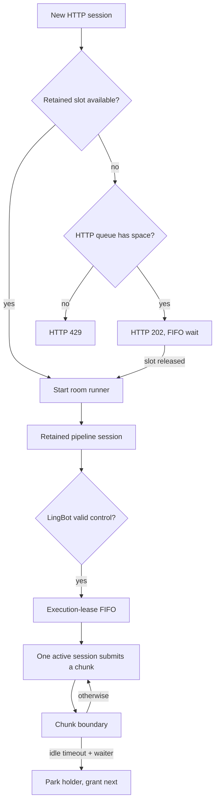
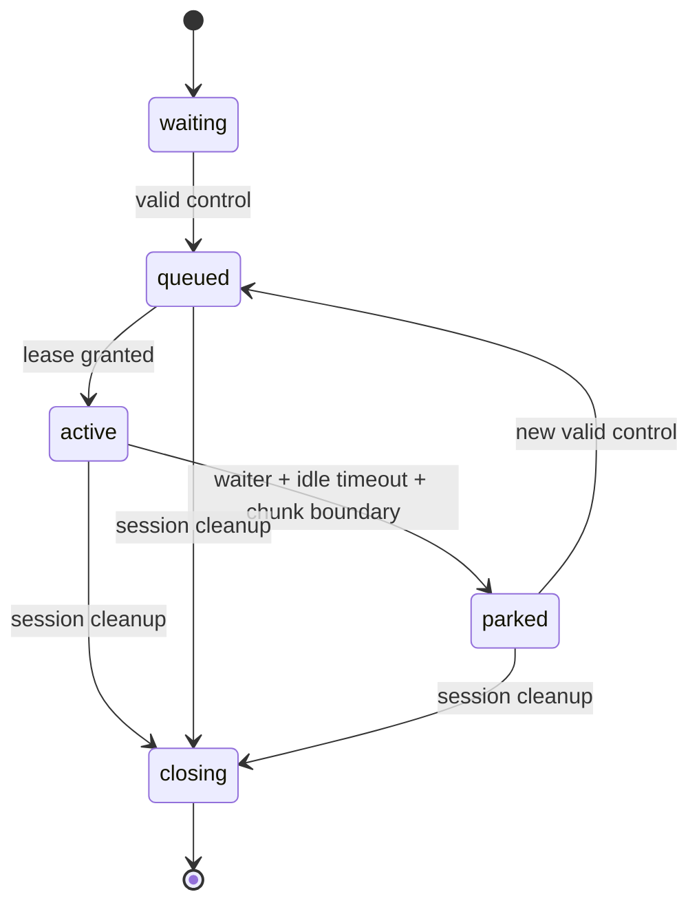
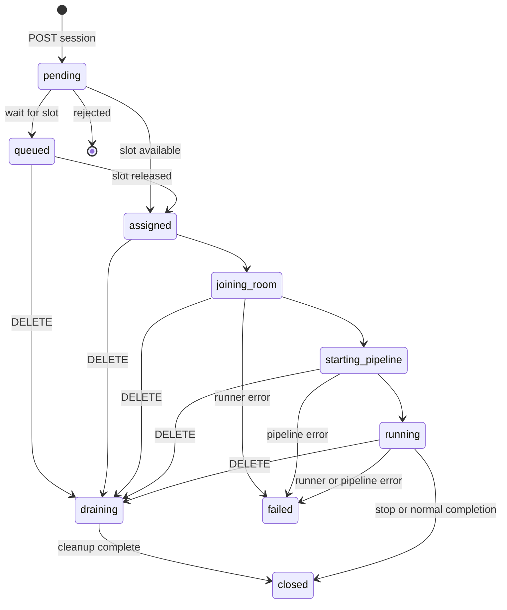

# Stream Server

`telefuser stream-serve` exposes TeleFuser's LiveKit-backed streaming API. It accepts a pipeline file whose
`get_service()` returns either `ServerPushService` or `BidirectionalService`.

LiveKit owns signaling, WebRTC connections, SFU media delivery, and transport reconnects. TeleFuser owns HTTP
admission, tokens, model workers, pipeline sessions, execution policy, and model-state cleanup. A LiveKit Cloud
project or self-hosted LiveKit Server is required; TeleFuser does not expose a direct SDP endpoint.

Use the three service guides at different boundaries:

- [Service](service.md) compares `serve` and `stream-serve`.
- This guide defines the LiveKit API, room roles, capacity, lifecycle, and deployment behavior.
- [Streaming Pipeline Scheduler](stream_scheduler.md) defines actor ownership and bounded intra-pipeline dataflow.

## Runtime topology



| Term | Meaning and ownership |
|---|---|
| Service process | One `telefuser stream-serve` parent containing the HTTP API, registry, admission scheduler, and either in-process or spawned model workers. |
| Model worker | Loads the pipeline file once, owns one service instance, and accounts for retained-session capacity. |
| Service instance | The single object returned by `get_service()`; model weights and its pipeline actor graph are loaded once. |
| HTTP session | TeleFuser's public admission and lifecycle record. It maps one-to-one to a room name and, after admission, a room runner. |
| Room runner | One task and one TeleFuser worker participant connected to a LiveKit room. Multiple runners share the service instance. |
| Pipeline session | Per-user state returned by `BidirectionalService.create_session()`, such as control, noise, VAE, and model-cache state. |
| Stage actor | An internal pipeline execution owner. It is not the model worker that owns retained-session capacity. |

`worker_mode=in-process` loads every configured replica in the API process. `worker_mode=process` uses the
multiprocessing `spawn` context and loads exactly one service instance in each model-worker process. The parent
process remains model-free and owns admission, health, and lifecycle state; capacity and session events cross a
IPC control plane rather than executing model work on the API event loop. Each process worker retains and
batches its own sessions, so one slow or failed GPU worker does not serialize the other GPU workers.

`worker_mode=process-nccl` keeps the LiveKit room transport in the parent and puts only the model session in
fixed, one-GPU child processes. At a chunk boundary it moves retained model tensors with NCCL point-to-point
operations, then switches the parent route after the ownership commit. Plain `process` mode continues to report
`migration_supported=false`.

## Service contracts and capacity

| Contract | Input and output | Retained-session capacity |
|---|---|---|
| `ServerPushService` | Starts from request configuration and publishes progressive video/audio without room controls. | Exactly one; startup rejects `max_sessions_per_worker > 1`. |
| `BidirectionalService` | Creates per-user state, accepts normalized controls, and yields output chunks. | May exceed one only when the implementation isolates state and defines safe cross-session execution. |

`max_sessions_per_worker` is an admission limit, not a replica count, batch size, or graph-edge capacity. Its default
value, `auto`, calculates capacity after pipeline warmup from worker-local free GPU memory, steady-state transient
peaks, and a 5% safety margin with a 2 GiB minimum per device. Transient allocations replaced by the fixed DiT pool
are excluded from the steady-state peak. An explicit integer only lowers that result; it never forces admission
beyond the calculated safe capacity. The
reusable mechanism lives in `telefuser.cache.session_memory`: stages capture raw device snapshots, while each
pipeline supplies role-specific retained-memory budgets and owns its concrete tensor layout. The module calculates
capacity and manages storage-agnostic slot leases, so other streaming pipelines can reuse it without depending on
LingBot.

The
checked-in LingBot-World-Fast and LingBot-World v2 services support multiple retained sessions and serialize their
model chunks with a shared execution lease. Other bidirectional services must provide their own concurrency policy.

Before admission starts, LingBot allocates fixed DiT self/cross-attention KV slots and VAE encoder/decoder temporal
cache slots for the calculated capacity. Warmup records the VAE cache-entry layouts; each fixed VAE slot includes 10%
shape headroom. Creating and closing a session only acquires and returns slots, so retained cache storage is not
freed and reallocated. The per-device safety margin covers smaller untracked state and allocator fragmentation.
Service metadata reports the raw per-device facts, reusable allocator reservations, role-specific retained bytes,
pool profiles, limiting device, and effective capacity under `session_capacity`.

## Local development stack

The LiveKit Python SDK is included in TeleFuser. Install the LiveKit Server and your platform's `coturn` package
separately:

```bash
pip install -e .

# Debian/Ubuntu; use the equivalent package on other platforms.
sudo apt-get update
sudo apt-get install -y coturn

curl -sSL https://get.livekit.io | bash
```

The checked-in browser demo forces TCP TURN relay. Run the following development-only stack in four terminals:

```bash
# Terminal 1: TURN relay matching the browser configuration
turnserver -n -m 1 \
  --listening-ip=127.0.0.1 --relay-ip=127.0.0.1 \
  --listening-port=3478 --min-port=49160 --max-port=49200 \
  --user=livekit-demo:livekit-demo-password --realm=livekit.local \
  --fingerprint --lt-cred-mech --no-tls --no-dtls --no-cli \
  --allow-loopback-peers

# Terminal 2: signaling and SFU
livekit-server --dev

# Terminal 3: model, admission, and session API
TF_MODEL_ZOO_PATH=/path/to/model_zoo \
CUDA_VISIBLE_DEVICES=0,1,2,3 \
telefuser stream-serve examples/lingbot/lingbot_world_fast_image_to_video_h100.py \
  --livekit-url ws://127.0.0.1:7880 \
  --livekit-api-key devkey \
  --livekit-api-secret secret \
  --worker-gpu-map 0,1,2,3 \
  --max-sessions-per-worker 2 \
  --control-idle-timeout 10 \
  --port 8088 \
  --skip-validation

# Terminal 4: browser page and HTTP API proxy
python examples/stream_server/livekit_bidirectional_demo.py \
  --server-url http://127.0.0.1:8088 \
  --port 8092 \
  --no-open
```

Open `http://127.0.0.1:8092`, select an image, and click **Start**. With VS Code Remote SSH, forward TCP ports
`8092`, `7880`, `3478`, and the TURN relay range `49160-49200` to the same local ports. The page proxies the
session API, so `8088` does not need browser-side forwarding. For a single ABot session, set coturn's min/max relay
port to `49160` and forward only that port.

The loopback TURN listener, static password, disabled TLS, `--allow-loopback-peers`, LiveKit development
credentials, and `--skip-validation` are for a trusted development host only. Stop the browser session before
stopping terminals 4 through 1.

## Session creation and room joining

TeleFuser assigns a unique room name and mints scoped tokens. It does not call the LiveKit room-management API to
create the room; LiveKit materializes it when the first participant joins.



A queued response already contains a room name and controller token, but no room runner publishes output until
admission. Token lifetime limits when a token may be used to join; it is separate from TeleFuser session cleanup.

## One controller and multiple viewers



| Role | LiveKit grants | TeleFuser semantics |
|---|---|---|
| Controller | Subscribe; publish data; no media-track publication | The session's configured controller identity. Only its `tf.control` messages are accepted. |
| Viewer | Subscribe; publish neither data nor media tracks | Watches the same output and status without pipeline-control permission. |
| Worker | Publish media and data; no subscription | Runs the session and publishes one output for LiveKit to fan out. |

Create the HTTP session once, then call `POST /v1/stream/sessions/{session_id}/tokens` with a distinct identity for
each viewer. A viewer joins the existing room and does not create another HTTP session, runner, or pipeline session.
Viewers do not consume `max_sessions_per_worker`, enter a TeleFuser queue, acquire an execution lease, duplicate
model state, or trigger inference. LiveKit/SFU delivery bandwidth and subscriber work still grow with viewer count.

Viewer joins and departures do not change TeleFuser admission or session state. Controller departure is also not
currently observed; clients must explicitly close the session when control ends.

## Admission, queues, and LingBot execution



There are three independent scheduling boundaries:

| Boundary | Capacity owner | What waiting means |
|---|---|---|
| HTTP admission queue | LiveKit runtime | All retained slots are occupied. `queue_size` bounds this FIFO; zero disables it. |
| LingBot execution-lease queue | Shared LingBot service instance | An admitted session wants model execution while another session holds the lease. |
| Pipeline artifact queues | `StreamingPipelineOrchestrator` | A stage or downstream bounded edge cannot yet admit another sequence item. |

The execution lease is LingBot-specific. A valid `control_state`, `control`, `prompt`, or `reset` records
activity and queues a waiting or parked session. If another session is waiting and the holder has been control-idle
for `control_idle_timeout`, the holder completes its in-flight chunk, parks, and hands off the lease. Handoff never
interrupts a chunk.



Parking does not close the session, release its retained slot, or free its cache. Set
`max_sessions_per_worker` from measured per-session memory headroom. Controllers representing held input must resend
`control_state`; the checked-in browser sends it once per second while a key remains held. Releasing the execution
lease never moves a session back to the HTTP queue.

## Session lifecycle and current limits



Cleanup stops new work, closes the pipeline session through its owner, disconnects the worker participant, releases
the retained slot, and admits the next HTTP-queued session. TeleFuser does not explicitly delete the LiveKit room;
remaining browser participants and the LiveKit deployment determine the transport room's later lifetime.

The current runtime has these deliberate documentation-visible limitations:

- `session_timeout` records `expires_at`, but no background task currently changes the session to `expired`.
- `controller_timeout` and `room_empty_timeout` are accepted configuration values but are not enforced.
- Participant events are not monitored, so `participant_count` remains `0` and departure does not trigger cleanup.
- Terminal records remain in the in-memory registry for the lifetime of the process. They are not shared or restored.
- A controller should send `stop` or call DELETE. Closing a browser tab alone does not release capacity.

## HTTP API

| Endpoint | Method | Purpose |
|---|---|---|
| `/v1/stream/sessions` | POST | Create and admit a controller session |
| `/v1/stream/sessions/{session_id}` | GET | Read the in-memory session record |
| `/v1/stream/sessions/{session_id}` | DELETE | Drain, close, and release the session |
| `/v1/stream/sessions/{session_id}/tokens` | POST | Mint a subscribe-only viewer token |
| `/v1/stream/health` | GET | Read scheduler and aggregate worker health |
| `/v1/service/health` | GET | Read generic service health |
| `/v1/service/ready` | GET | Readiness probe |
| `/v1/service/metadata` | GET | Runtime topology and service metadata |
| `/v1/service/metrics` | GET | Prometheus text metrics |
| `/metrics` | GET | Prometheus-compatible alias of `/v1/service/metrics` |
| `/v1/service/metrics/json` | GET | JSON service and LiveKit health metrics |

Create a controller session:

```bash
curl -X POST http://127.0.0.1:8088/v1/stream/sessions \
  -H 'Content-Type: application/json' \
  -d '{
    "identity": "controller-1",
    "prompt": "A first-person view moving through a forest",
    "image_path": "examples/lingbot/assets/test_1.jpeg",
    "config": {"fps": 16}
  }'
```

Create a viewer token for the same room:

```bash
curl -X POST http://127.0.0.1:8088/v1/stream/sessions/<session_id>/tokens \
  -H 'Content-Type: application/json' \
  -d '{"identity":"viewer-1"}'
```

Close and release the session:

```bash
curl -X DELETE http://127.0.0.1:8088/v1/stream/sessions/<session_id>
```

A direct admission returns HTTP 200. A bounded wait returns HTTP 202 with `queue_position`; a disabled or full queue
returns HTTP 429. The one-minute LingBot-World v2 workload and observed four-H100 results are documented in
[TeleFuser and AIPerf](benchmark_aiperf.md).


## Serving observability

`/metrics` is the conventional Prometheus scrape alias for `/v1/service/metrics`.
For any LiveKit stream-serve service it includes bounded worker/GPU, scheduler, batch, queue, pipeline
stage, SLO, migration, action-to-first-frame, and published-FPS series; it never
uses a session ID as a Prometheus label. The companion JSON endpoint contains only
aggregate serving summaries.

For a monitored deployment, launch the checked-in [Prometheus, Grafana, DCGM
Exporter, and Node Exporter stack](../../deploy/observability/README.md). The
checked-in compose file monitors physical GPUs 0--3 by default; override
`TELEFUSER_MONITOR_GPU_IDS` to select another physical set. Keep this distinct
from the serving process's logical `CUDA_VISIBLE_DEVICES` view. If Docker is not
available, use `tools/validation/capture_serving_metrics.py` to save the
same serving metrics as an experiment artifact (it does not collect DCGM GPU
hardware counters).

## LiveKit data protocol

| Topic | Direction | Delivery | Current use |
|---|---|---|---|
| `tf.control` | Controller to worker | Reliable in the checked-in clients | `control_state`, `control`, `prompt`, `reset`, and `stop` |
| `tf.status` | Worker to room | Reliable | Runner lifecycle, errors, chunk metadata, and completion |
| `tf.metrics` | Worker to room | Lossy | Supported by the room client, but not emitted by the generic runner today |
| `tf.asset` | Reserved | Not defined | Future bounded asset messages |

Example control:

```json
{"type":"control_state","controls":["w","j"]}
```

An optional versioned envelope is also accepted:

```json
{"version":1,"session_id":"<id>","type":"control_state","payload":{"controls":["w"]}}
```

Inbound messages are bounded by `max_data_message_bytes` (12 KiB by default). Wrong topics, non-controller senders,
invalid JSON, unknown controls, duplicates, and session mismatches are rejected.

## CLI, environment, and GPU placement

```text
telefuser stream-serve PIPE_PATH [OPTIONS]
```

Use `telefuser stream-serve --help` for the complete option list. The options with important runtime semantics are:

| Option | Default | Semantics |
|---|---:|---|
| `--host`, `--port` | `0.0.0.0`, `8088` | HTTP bind address |
| `--num-workers` | `1` | Number of model replicas; process mode starts one child per worker |
| `--worker-gpu-map` | unset | Semicolon-separated GPU group per worker, for example `0;1;2;3` |
| `--max-sessions-per-worker` | `auto` | Hardware-calculated retained sessions; an integer is a safety ceiling |
| `--queue-size` | `0` | HTTP admission FIFO length; zero rejects at capacity |
| `--control-idle-timeout` | `10` | LingBot lease idle threshold when another session waits |
| `--session-timeout` | `1800` | Records `expires_at`; not currently enforced |
| `--token-ttl` | `3600` | Join-token lifetime |
| `--controller-timeout` | `60` | Reserved; not currently enforced |
| `--room-empty-timeout` | `30` | Reserved; not currently enforced |
| `--worker-mode` | `in-process` | Use `process` for independent multi-GPU model executors |

The CLI can fall back to `TELEFUSER_LIVEKIT_URL`, `TELEFUSER_LIVEKIT_API_KEY`,
`TELEFUSER_LIVEKIT_API_SECRET`, `TELEFUSER_LIVEKIT_WORKER_GPU_MAP`,
`TELEFUSER_LIVEKIT_MAX_SESSIONS_PER_WORKER`, and `TELEFUSER_LIVEKIT_CONTROL_IDLE_TIMEOUT` when their matching CLI
value is unset. Environment-only settings include `TELEFUSER_LIVEKIT_DEFAULT_FPS` (default `16`),
`TELEFUSER_LIVEKIT_MAX_DATA_MESSAGE_BYTES` (default `12288`), and
`TELEFUSER_LIVEKIT_CORS_ALLOW_ORIGINS` (default `["*"]`).

Other Click options currently pass their displayed defaults explicitly, so use the CLI option rather than a
same-named environment variable for those fields.

In process mode every worker group is passed to the child pipeline as explicit device IDs. Multiple process workers
require `worker_gpu_map`; duplicate GPU IDs are rejected before models load. Process isolation separates Python,
asyncio, CUDA contexts, and model executors, but it does not rewrite `CUDA_VISIBLE_DEVICES`. IDs in the map are
logical within the parent's visible-device set. For four one-GPU worker processes on physical GPUs 4-7, use:

```bash
CUDA_VISIBLE_DEVICES=4,5,6,7 \
telefuser stream-serve PIPE_PATH \
  --num-workers 4 \
  --worker-gpu-map '0;1;2;3' \
  --worker-mode process
```

This exposes physical GPUs 4-7 as local devices 0-3 and loads four independent service instances. A group may
contain multiple device IDs for a model replica that itself uses tensor, sequence, or pipeline parallelism. In
`in-process` mode the same map still binds adapters explicitly, but all replicas share the API process and its
Python runtime.

## Observability

| Signal | Exact interpretation |
|---|---|
| `workers_busy` | Model workers retaining at least one session. |
| `workers_idle` | Active model workers in the `idle` state; stopped autoscaling replicas are excluded. |
| `workers_failed` | Workers whose aggregate state is failed. |
| `queued_sessions` | HTTP admission queue depth only; it excludes LingBot lease and pipeline artifact waits. |
| `livekit_connected` | Derived from aggregate worker status being `starting_pipeline`, `running`, or `draining`; it is not a direct LiveKit server probe. |
| `participant_count` | Currently always `0` because participant events are not wired into the registry. |
| `lease_queued`, `lease_granted`, `lease_parked` | LingBot execution-lease transitions published through `tf.status`. |

`livekit_connected=false` is expected before any room runner reaches pipeline startup and does not mean model loading
failed. For pipeline performance, keep target compute metrics distinct from client delivery metrics; see
[Metrics](metrics.md) and [TeleFuser and AIPerf](benchmark_aiperf.md).

## Production and troubleshooting

- Use LiveKit Cloud or the official self-hosted deployment guidance; do not expose `livekit-server --dev`.
- Keep the LiveKit API secret on the TeleFuser server. Add deployment-layer authentication around the HTTP API.
- Configure TLS, advertised node addresses, UDP/TCP media ports, and TURN in LiveKit.
- Size retained-session capacity from GPU memory and LiveKit viewer capacity from SFU bandwidth.
- Monitor readiness, worker failure, HTTP queue depth, pipeline cadence, and explicit session cleanup.

Common failures:

- **Ready but no media:** verify that the worker and browser can reach LiveKit and inspect participant/track logs.
- **Repeated browser reconnects:** check signaling, TURN credentials, firewall, and advertised LiveKit addresses.
- **Controls ignored:** use the controller token, `tf.control`, a supported type, and the configured identity.
- **HTTP 429:** retained slots and the configured HTTP queue are full, or the queue is disabled.
- **Session remains after clients leave:** departure cleanup is not implemented; send `stop` or call DELETE.
- **Local LiveKit returns proxy HTTP 503:** unset upper- and lowercase `HTTP_PROXY`, `HTTPS_PROXY`, and `ALL_PROXY`
  for a local `ws://127.0.0.1:7880` deployment; some native SDK paths do not apply `NO_PROXY`.
- **Workers remain after forced exit:** terminate stale `spawn_main` children before restarting.
