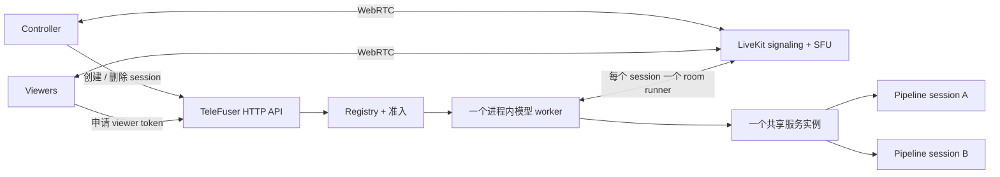
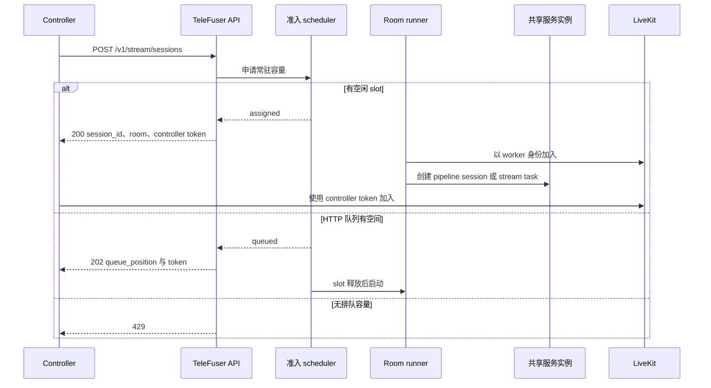
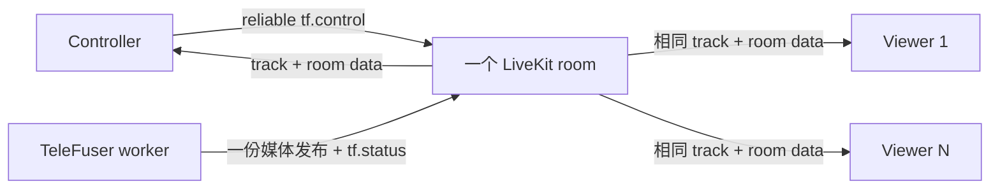
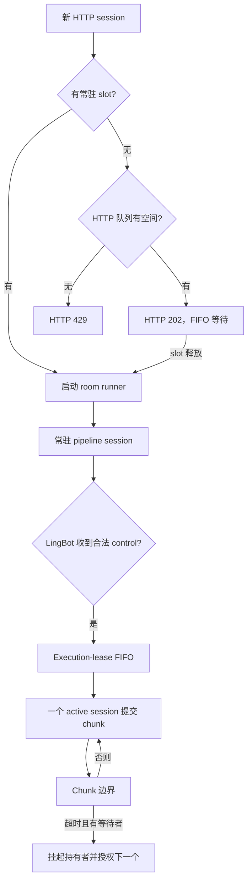
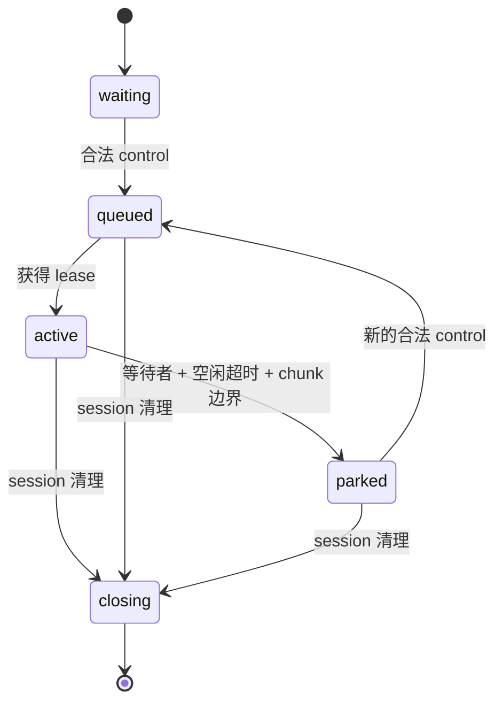
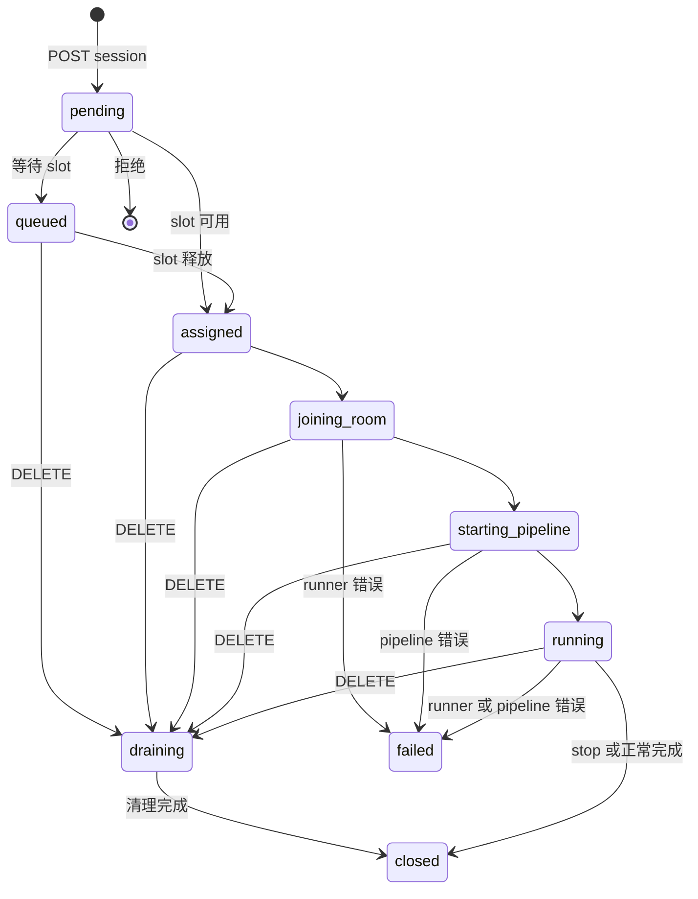

# 流式服务

`telefuser stream-serve` 提供基于 LiveKit 的 TeleFuser 流式 API。它接收一个 pipeline 文件，其中
`get_service()` 必须返回 `ServerPushService` 或 `BidirectionalService`。

LiveKit 负责 signaling、WebRTC 连接、SFU 媒体分发和传输层重连；TeleFuser 负责 HTTP 准入、token、模型
worker、pipeline session、执行策略和模型状态清理。因此必须使用 LiveKit Cloud 或自托管 LiveKit Server；
TeleFuser 不提供直接 SDP 接口。

三份服务文档分别描述不同边界：

- [服务指南](service.md)比较 `serve` 与 `stream-serve`；
- 本文定义 LiveKit API、room 角色、容量、生命周期和部署行为；
- [流式 Pipeline 调度器](stream_scheduler.md)定义 actor 所有权与 pipeline 内有界数据流。

## Runtime 拓扑



| 术语 | 含义与所有权 |
|---|---|
| 服务进程 | 一个 `telefuser stream-serve` 进程，包含 HTTP API、registry、准入 scheduler 和当前进程内 worker。 |
| 模型 worker | 只加载一次 pipeline 文件，拥有一个服务实例，并统计常驻 session 容量。 |
| 服务实例 | `get_service()` 返回的单个对象；模型权重及其 pipeline actor graph 只加载一次。 |
| HTTP session | TeleFuser 对外提供的准入和生命周期记录；它与 room name 一一对应，准入后也与 room runner 一一对应。 |
| Room runner | 一个 task，以及一个连接到 LiveKit room 的 TeleFuser worker participant；多个 runner 共享服务实例。 |
| Pipeline session | `BidirectionalService.create_session()` 返回的用户独立状态，例如 control、noise、VAE 和模型 cache。 |
| Stage actor | Pipeline 内部的执行所有者，不是拥有常驻 session 容量的模型 worker。 |

当前 runtime 只支持一个 `in-process` 模型 worker，并且只调用一次 `get_service()`。多个用户不会加载多个
模型副本。额外副本需要启动独立的 `stream-serve` 进程并在外部路由请求；各进程的 registry、队列、健康状态
和 session 状态彼此独立。

## 服务契约与容量

| 契约 | 输入与输出 | 常驻 session 容量 |
|---|---|---|
| `ServerPushService` | 根据请求配置启动，无需 room control，渐进发布视频/音频。 | 只能为 1；`max_sessions_per_worker > 1` 时启动失败。 |
| `BidirectionalService` | 创建用户独立状态，接收规范化 control，并持续输出 chunk。 | 只有在实现隔离状态并定义安全的跨 session 执行策略时才可大于 1。 |

`max_sessions_per_worker` 是准入上限，不是副本数、batch size 或 graph edge capacity。默认值 `auto` 在
pipeline warmup 后根据各 stage worker 的 GPU 空闲显存、稳态临时峰值和每张设备 5%（最低 2 GiB）的安全余量
计算容量；固定 DiT pool 已替代的动态分配不会重复计入稳态峰值。显式整数只会降低计算结果，不会强制接受超出
安全容量的 session。

通用机制位于 `telefuser.cache.session_memory`：stage 采集原始设备画像，各 pipeline 提供按角色拆分的
常驻显存预算并拥有具体张量布局。该模块只负责容量计算和与 storage 无关的 slot 租约，因此其他流式 pipeline
无需依赖 LingBot 即可复用。

仓库内
LingBot-World-Fast 和 LingBot-World v2 支持多个常驻 session，并通过共享 execution lease 串行执行模型
chunk。其他双向服务必须自行提供跨 session 并发策略。

LingBot 在开始准入前一次性申请计算容量对应的 DiT self/cross-attention KV slot，以及 VAE
encoder/decoder 时序 cache slot。warmup 会记录 VAE cache entry 布局，每个固定 VAE slot 额外保留 10%
形状余量。session 创建和关闭只领取和归还 slot，不再释放并重新申请常驻 cache storage。每张设备的安全余量
覆盖较小的未跟踪状态和 allocator 碎片。服务 metadata 的 `session_capacity` 字段包含每张设备的原始画像、
可复用 allocator reservation、按角色拆分的常驻字节、pool profile、限制设备和最终容量。

## 本地开发链路

LiveKit Python SDK 已包含在 TeleFuser 中。LiveKit Server 与当前平台的 `coturn` 软件包需要单独安装：

```bash
pip install -e .

# Debian/Ubuntu；其他平台请使用对应的软件包。
sudo apt-get update
sudo apt-get install -y coturn

curl -sSL https://get.livekit.io | bash
```

仓库内浏览器 demo 强制使用 TCP TURN relay。请在四个终端运行以下仅供开发使用的链路：

```bash
# Terminal 1：与浏览器配置匹配的 TURN relay
turnserver -n -m 1 \
  --listening-ip=127.0.0.1 --relay-ip=127.0.0.1 \
  --listening-port=3478 --min-port=49160 --max-port=49200 \
  --user=livekit-demo:livekit-demo-password --realm=livekit.local \
  --fingerprint --lt-cred-mech --no-tls --no-dtls --no-cli \
  --allow-loopback-peers

# Terminal 2：signaling 与 SFU
livekit-server --dev

# Terminal 3：模型、准入和 session API
TF_MODEL_ZOO_PATH=/path/to/model_zoo \
CUDA_VISIBLE_DEVICES=0,1,2,3 \
telefuser stream-serve examples/lingbot/lingbot_world_fast_image_to_video_h100.py \
  --livekit-url ws://127.0.0.1:7880 \
  --livekit-api-key devkey \
  --livekit-api-secret secret \
  --worker-gpu-map 0,1,2,3 \
  --max-sessions-per-worker 2 \
  --control-idle-timeout 10 \
  --port 8088 \
  --skip-validation

# Terminal 4：浏览器页面与 HTTP API proxy
python examples/stream_server/livekit_bidirectional_demo.py \
  --server-url http://127.0.0.1:8088 \
  --port 8092 \
  --no-open
```

打开 `http://127.0.0.1:8092`，选择图片并点击 **Start**。使用 VS Code Remote SSH 时，把远端 TCP
`8092`、`7880` 和 `3478` 映射到相同本地端口。页面会代理 session API，因此浏览器侧无需映射
`8088`。

Loopback TURN listener、静态密码、禁用 TLS、`--allow-loopback-peers`、LiveKit 开发凭据和
`--skip-validation` 仅适用于可信开发主机。关闭时应先停止浏览器 session，再按 terminal 4 到 1 的顺序停止。

## Session 创建与 room 加入

TeleFuser 分配唯一 room name 并签发受限 token，但不会调用 LiveKit room-management API 显式创建 room；
第一个 participant 加入时由 LiveKit 建立 room。



排队响应已经包含 room name 和 controller token，但在准入并启动 room runner 前不会有输出。Token 生命周期
限制 token 可用于加入的时间，与 TeleFuser session 清理是两个不同概念。

## 一处控制与多处观看



| 角色 | LiveKit grant | TeleFuser 语义 |
|---|---|---|
| Controller | 可订阅、可发布 data、不能发布媒体 track | Session 配置的 controller identity；只有它发送的 `tf.control` 会被接受。 |
| Viewer | 可订阅、不能发布 data 或媒体 track | 观看相同输出与状态，没有 pipeline 控制权限。 |
| Worker | 可发布媒体与 data、不订阅 | 运行 session 并发布一份输出，由 LiveKit 分发给所有订阅者。 |

HTTP session 只创建一次，然后为每个 viewer 使用不同 identity 调用
`POST /v1/stream/sessions/{session_id}/tokens`。Viewer 加入已有 room，不创建新的 HTTP session、runner 或
pipeline session，也不占用 `max_sessions_per_worker`、不进入 TeleFuser 队列、不申请 execution lease、不
复制模型状态、不触发推理。不过 LiveKit/SFU 的分发带宽和订阅开销仍会随 viewer 数量增长。

Viewer 加入或离开不会改变 TeleFuser 准入和 session 状态。当前也不会监听 controller 离开，控制结束时客户端
必须显式关闭 session。

## 准入、队列与 LingBot 执行



系统有三个相互独立的调度边界：

| 边界 | 容量所有者 | 等待的含义 |
|---|---|---|
| HTTP 准入队列 | LiveKit runtime | 所有常驻 slot 已占用；`queue_size` 限制该 FIFO，零表示禁用。 |
| LingBot execution-lease 队列 | 共享 LingBot 服务实例 | 已准入 session 申请模型执行，但另一个 session 正持有 lease。 |
| Pipeline artifact 队列 | `StreamingPipelineOrchestrator` | Stage 或下游有界 edge 暂时不能准入新的 sequence item。 |

Execution lease 是 LingBot 专属策略。合法的 `control_state`、`control`、`prompt` 或 `reset` 会记录
活跃时间，并让 waiting/parked session 排队。如果存在等待者，且持有者已超过
`control_idle_timeout` 没有控制活动，持有者会完成在途 chunk，然后停放并交出 lease；切换不会中断 chunk。



停放不会关闭 session、释放常驻 slot 或清除 cache。应根据实测单 session 显存余量设置
`max_sessions_per_worker`。持续按住输入时 controller 必须重发 `control_state`；仓库内浏览器在按键保持时
每秒发送一次。交出 execution lease 不会让 session 回到 HTTP 队列。

## Session 生命周期与当前限制



清理过程停止接收新任务，通过状态所有者关闭 pipeline session，断开 worker participant，释放常驻 slot，并
准入下一条 HTTP 排队 session。TeleFuser 不会显式删除 LiveKit room；剩余浏览器 participant 与 LiveKit 部署
共同决定传输 room 后续的生命周期。

当前 runtime 有以下需要显式说明的限制：

- `session_timeout` 会记录 `expires_at`，但当前没有后台任务把 session 改为 `expired`；
- `controller_timeout` 和 `room_empty_timeout` 可配置，但尚未执行；
- 没有监听 participant 事件，因此 `participant_count` 始终为 `0`，participant 离开不会触发清理；
- 终态记录在进程生命周期内保留于内存 registry，不在进程间共享，也不会在重启后恢复；
- Controller 应发送 `stop` 或调用 DELETE；仅关闭浏览器页面不会释放容量。

## HTTP API

| 接口 | 方法 | 用途 |
|---|---|---|
| `/v1/stream/sessions` | POST | 创建并准入 controller session |
| `/v1/stream/sessions/{session_id}` | GET | 读取内存中的 session 记录 |
| `/v1/stream/sessions/{session_id}` | DELETE | Drain、关闭并释放 session |
| `/v1/stream/sessions/{session_id}/tokens` | POST | 签发仅订阅的 viewer token |
| `/v1/stream/health` | GET | Scheduler 与聚合 worker 健康状态 |
| `/v1/service/health` | GET | 通用服务健康状态 |
| `/v1/service/ready` | GET | Readiness probe |
| `/v1/service/metadata` | GET | Runtime 拓扑与服务 metadata |
| `/v1/service/metrics` | GET | Prometheus 文本指标 |
| `/metrics` | GET | `/v1/service/metrics` 的 Prometheus 兼容别名 |
| `/v1/service/metrics/json` | GET | JSON 服务与 LiveKit 健康指标 |

创建 controller session：

```bash
curl -X POST http://127.0.0.1:8088/v1/stream/sessions \
  -H 'Content-Type: application/json' \
  -d '{
    "identity": "controller-1",
    "prompt": "A first-person view moving through a forest",
    "image_path": "examples/lingbot/assets/test_1.jpeg",
    "config": {"fps": 16}
  }'
```

为同一 room 创建 viewer token：

```bash
curl -X POST http://127.0.0.1:8088/v1/stream/sessions/<session_id>/tokens \
  -H 'Content-Type: application/json' \
  -d '{"identity":"viewer-1"}'
```

关闭并释放 session：

```bash
curl -X DELETE http://127.0.0.1:8088/v1/stream/sessions/<session_id>
```

直接准入返回 HTTP 200；有界等待返回 HTTP 202 和 `queue_position`；队列禁用或已满时返回 HTTP 429。
一分钟 LingBot-World v2 workload 与四张 H100 的实测结果见
[TeleFuser 与 AIPerf](benchmark_aiperf.md)。


## Serving 可观测性

`/metrics` 是 `/v1/service/metrics` 的标准 Prometheus scrape 别名。对
任何 LiveKit stream-serve 服务都会导出有界的 worker/GPU、scheduler、batch、队列、pipeline stage、SLO、
migration、action-to-first-frame 和 published-FPS 指标；不会把 session ID 作为
Prometheus label。JSON 端点只返回聚合后的 serving 摘要。

可直接启动仓库内的 [Prometheus、Grafana、DCGM Exporter 和 Node
Exporter 栈](../../deploy/observability/README.md)。其中 compose 监控物理 GPU
0--3（默认值）；可通过 `TELEFUSER_MONITOR_GPU_IDS` 选择其他物理卡。它与
serving 进程的逻辑 `CUDA_VISIBLE_DEVICES` 视图不同。若实验机无法运行 Docker，
可运行 `tools/validation/capture_serving_metrics.py` 保存同一 serving
指标作为实验 artifact；该方式不包含 DCGM 的 GPU 硬件计数器。

## LiveKit 数据协议

| Topic | 方向 | 传输 | 当前用途 |
|---|---|---|---|
| `tf.control` | Controller 到 worker | 仓库内客户端使用 reliable | `control_state`、`control`、`prompt`、`reset` 和 `stop` |
| `tf.status` | Worker 到 room | Reliable | Runner 生命周期、错误、chunk metadata 和完成状态 |
| `tf.metrics` | Worker 到 room | Lossy | Room client 支持，但通用 runner 当前不发送 |
| `tf.asset` | 保留 | 未定义 | 未来的有界 asset 消息 |

Control 示例：

```json
{"type":"control_state","controls":["w","j"]}
```

也可使用带版本的 envelope：

```json
{"version":1,"session_id":"<id>","type":"control_state","payload":{"controls":["w"]}}
```

入站消息默认受 `max_data_message_bytes`（12 KiB）限制。错误 topic、非 controller sender、非法 JSON、未知
control、重复项和 session 不匹配都会被拒绝。

## CLI、环境变量与 GPU 放置

```text
telefuser stream-serve PIPE_PATH [OPTIONS]
```

完整选项见 `telefuser stream-serve --help`。以下选项具有重要 runtime 语义：

| 选项 | 默认值 | 语义 |
|---|---:|---|
| `--host`、`--port` | `0.0.0.0`、`8088` | HTTP 监听地址 |
| `--num-workers` | `1` | 当前 runtime 必须保持为 `1` |
| `--worker-gpu-map` | 未设置 | 当前 worker 的一个逻辑 GPU group，例如 `0,1,2,3` |
| `--max-sessions-per-worker` | `auto` | 按硬件计算常驻 session 数；整数表示安全上限 |
| `--queue-size` | `0` | HTTP 准入 FIFO 长度；零表示容量满时拒绝 |
| `--control-idle-timeout` | `10` | 有其他 session 等待时，LingBot lease 的控制空闲阈值 |
| `--session-timeout` | `1800` | 记录 `expires_at`，当前尚未执行 |
| `--token-ttl` | `3600` | Join token 生命周期 |
| `--controller-timeout` | `60` | 预留，当前尚未执行 |
| `--room-empty-timeout` | `30` | 预留，当前尚未执行 |
| `--worker-mode` | `in-process` | CLI 接受 `process`，但 runtime 尚未实现 |

对应 CLI 值未设置时，命令可回退到 `TELEFUSER_LIVEKIT_URL`、
`TELEFUSER_LIVEKIT_API_KEY`、`TELEFUSER_LIVEKIT_API_SECRET`、
`TELEFUSER_LIVEKIT_WORKER_GPU_MAP`、`TELEFUSER_LIVEKIT_MAX_SESSIONS_PER_WORKER` 和
`TELEFUSER_LIVEKIT_CONTROL_IDLE_TIMEOUT`。仅通过环境变量配置的字段包括
`TELEFUSER_LIVEKIT_DEFAULT_FPS`（默认 `16`）、`TELEFUSER_LIVEKIT_MAX_DATA_MESSAGE_BYTES`（默认
`12288`）和 `TELEFUSER_LIVEKIT_CORS_ALLOW_ORIGINS`（默认 `["*"]`）。

其他 Click 选项当前会显式传递其界面默认值，因此这些字段应使用 CLI 选项，而不是同名环境变量。

在当前进程内 runtime 中，`worker_gpu_map` 只记录 scheduler 拓扑，并把 group 大小作为 `gpu_num` 传给
`get_service()`；它不会设置 `CUDA_VISIBLE_DEVICES`、隔离设备或重写 `ModelRuntimeConfig`。请先用
`CUDA_VISIBLE_DEVICES` 选择物理 GPU，并确保 pipeline 使用对应的进程内 device index。例如：

```bash
CUDA_VISIBLE_DEVICES=4,5,6,7 \
telefuser stream-serve PIPE_PATH --worker-gpu-map 0,1,2,3
```

此时物理 GPU 4-7 在进程内显示为 device 0-3，并向 `get_service()` 传递 `gpu_num=4`；仍只加载一个服务实例。

## 可观测性

| 信号 | 准确含义 |
|---|---|
| `workers_busy` | 至少保留一个 session 的模型 worker 数；当前 runtime 中只能为 `0` 或 `1`。 |
| `workers_idle` | 没有常驻 session 且未失败的模型 worker 数。 |
| `workers_failed` | 聚合状态为 failed 的 worker 数。 |
| `queued_sessions` | 只统计 HTTP 准入队列，不包括 LingBot lease 或 pipeline artifact 等待。 |
| `livekit_connected` | 根据聚合 worker 状态是否为 `starting_pipeline`、`running` 或 `draining` 推导，并非对 LiveKit Server 的直接探测。 |
| `participant_count` | 当前始终为 `0`，因为 participant 事件尚未写入 registry。 |
| `lease_queued`、`lease_granted`、`lease_parked` | 通过 `tf.status` 发布的 LingBot execution-lease 状态变化。 |

Room runner 尚未进入 pipeline startup 前，`livekit_connected=false` 是正常状态，并不表示模型加载失败。
Pipeline 性能指标应与客户端交付指标分开解释，参见[监控指标](metrics.md)和
[TeleFuser 与 AIPerf](benchmark_aiperf.md)。

## 生产部署与故障排查

- 使用 LiveKit Cloud 或官方自托管部署方式，不要暴露 `livekit-server --dev`；
- LiveKit API secret 只能保存在 TeleFuser 服务端，并应在部署层为 HTTP API 增加鉴权；
- 在 LiveKit 中配置 TLS、advertised node address、UDP/TCP media port 和 TURN；
- 根据 GPU 显存设置常驻 session 容量，根据 SFU 带宽设置 viewer 容量；
- 监控 readiness、worker failure、HTTP queue depth、pipeline cadence 和显式 session 清理。

常见问题：

- **Ready 但没有媒体：**确认 worker 与浏览器都能访问 LiveKit，并检查 participant/track 日志；
- **浏览器反复重连：**检查 signaling、TURN 凭据、防火墙和 LiveKit advertised address；
- **控制无效：**使用 controller token、`tf.control`、支持的类型和配置的 identity；
- **HTTP 429：**常驻 slot 和配置的 HTTP 队列已满，或队列被禁用；
- **客户端离开后 session 仍存在：**尚未实现离开清理，请发送 `stop` 或调用 DELETE；
- **本地 LiveKit 返回 proxy HTTP 503：**本地使用 `ws://127.0.0.1:7880` 时，取消大小写形式的
  `HTTP_PROXY`、`HTTPS_PROXY` 和 `ALL_PROXY`；部分 native SDK 路径不会应用 `NO_PROXY`；
- **强制退出后残留 worker：**重启前终止遗留的 `spawn_main` 子进程。
